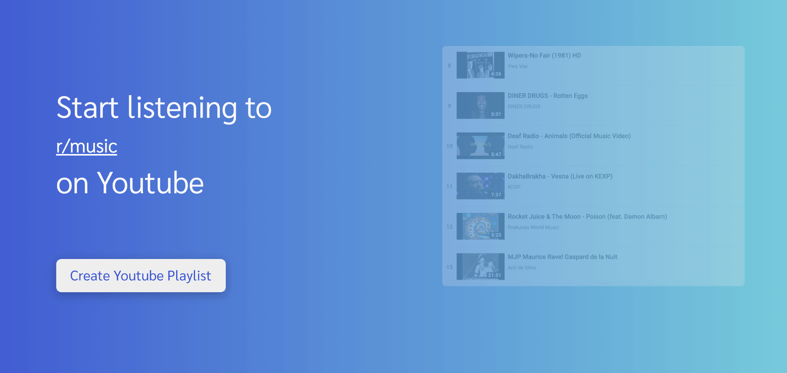

  
  <h1>Untune.io</h1>
   
  
<b>A tool to convert Reddit.com subreddits to Youtube Playlists</b>

  
Untune is a fullstack app built with React, Redux, Node, Reddit API, Youtube API, and Jest

   

 

## Contents

- [Overview](#overview)
- [Getting Started](#getting-started)
- [API](#API)
- [License](#license)

## Overview

